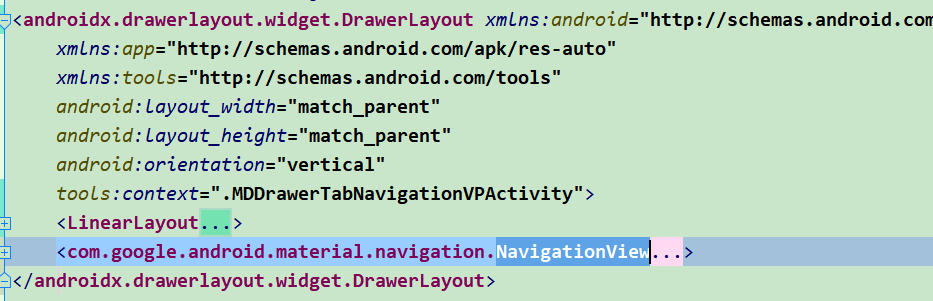
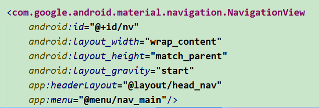

[TOC]

# MaterialDesign常用控件记录

### 1. Snackbar

为一个操作提供轻量级的、快速的反馈，可以它指定显示的位置、文本内容及可选的操作按钮，能在指定时间结束后消失、也可以配合CoordinatorLayout使用进行滑动删除

``` java
private void showSnackbar() {
    Snackbar.make(llContent,"这是一条Snackbar！",Snackbar.LENGTH_SHORT)
            .setAction("点击事件", new View.OnClickListener() {
                @Override
                public void onClick(View v) {
                   Toast.makeText(MainActivity.this, "点击Snackbar", Toast.LENGTH_SHORT).show();
                 }
             })
             .setDuration(Snackbar.LENGTH_SHORT).show();
    }
```

### 2. TextInputLayout

为输入框的提示提供一个平滑的过渡动画，同时对输入内容校验结果提供一个友好的提示

```java
//配置校验提示
private void setTIL() {
    til.getEditText().addTextChangedListener(new TextWatcher() {
        @Override
        public void beforeTextChanged(CharSequence s, int start, int count, int after) {
        }
        @Override
        public void onTextChanged(CharSequence s, int start, int before, int count) {
        }
        @Override
        public void afterTextChanged(Editable s) {
            if (s.toString().length()<6) {
                til.setErrorEnabled(true);
                til.setError("长度过短！");
            }else {
                til.setErrorEnabled(false);
            }
        }
    });
}
//XML配置使用
 <com.google.android.material.textfield.TextInputLayout
            android:id="@+id/til"
            style="@style/text_style"
            app:errorTextColor="#ffffff"
            app:hintTextColor="#ff0000"
            android:textColorHint="#ffffff">
            <EditText
                android:layout_width="match_parent"
                android:background="@null"
                android:hint="2.TextInputlayout"
                android:textColor="#ffffff"
                android:layout_height="match_parent"/>
</com.google.android.material.textfield.TextInputLayout>
```

### 3. DrawerLayout、TabLayout、Navigation——通用主页

- **DrawerLayout——侧滑菜单**

  1. 作用：丰富单一界面的可操作性，提供更多操作入口的显示与隐藏
  2. 使用：DrawerLayout作为根布局使用

  

  > 1. DrawerLayout 作为根布局使用，子布局1作为主屏幕内容，子View2作为菜单内容
  > 2. 子View2需要指定android:layout_gravity 属性 left，right，start(根据系统语言方向决定)来决定滑出的方向

- **NavigationView——快捷填充侧滑菜单布局**

  使用NavigationView作为菜单布局，指定headerLayout及menu布局便可以快速完成侧换页的功能

  

  > 具体使用中要记得对菜单选择进行监听
  >
  > ```java
  > nv.setNavigationItemSelectedListener(new NavigationView.OnNavigationItemSelectedListener() {
  >             @Override
  >             public boolean onNavigationItemSelected(@NonNull MenuItem item) {
  >                 item.setChecked(true);
  >                 initViewPager(item.getTitle().toString());
  >                 dl.closeDrawers();
  >                 return true;
  >             }
  >         });
  > ```

  ```xml
  head_nav.xml
  <?xml version="1.0" encoding="utf-8"?>
  <LinearLayout xmlns:android="http://schemas.android.com/apk/res/android"
      android:layout_width="match_parent"
      android:layout_height="150dp"
      android:gravity="center_vertical"
      android:orientation="horizontal">
      <ImageView
          android:id="@+id/iv"
          android:src="@mipmap/ic_launcher"
          android:layout_width="100dp"
          android:layout_height="100dp"/>
  
      <TextView
          android:id="@+id/tv_title"
          android:layout_width="0dp"
          android:layout_weight="1"
          android:text="Hello!"
          android:layout_height="wrap_content"
          android:gravity="center" />
  </LinearLayout>
  
  nav_main.xml
  <?xml version="1.0" encoding="utf-8"?>
  <menu xmlns:android="http://schemas.android.com/apk/res/android">
      <group android:checkableBehavior="single">
          <item
              android:id="@+id/nav_1"
              android:icon="@mipmap/ic_launcher"
              android:title="首页" />
          <item
              android:id="@+id/nav_2"
              android:icon="@mipmap/ic_launcher"
              android:title="内容" />
          <item
              android:id="@+id/nav_3"
              android:icon="@mipmap/ic_launcher"
              android:title="主题" />
      </group>
      <item android:title="其他">
          <menu>
              <item
                  android:icon="@mipmap/ic_launcher"
                  android:title="设置" />
              <item
                  android:icon="@mipmap/ic_launcher"
                  android:title="关于我们" />
          </menu>
      </item>
  </menu>
  ```

- **TabLayout配合ViewPager使用**

  对于TabLayout来说只需要添加对应数量的tab及设置与ViewPager的关联即可

  ```java
  tablayout.addTab(tablayout.newTab().setText("..."));
  tablayout.addTab(tablayout.newTab().setText("..."));
  ...
  vp.setAdapter(new FragmentAdapter(getSupportFragmentManager(), titles, fragments););
  tablayout.setupWithViewPager(vp);
  ```

  对于ViewPager来说，除了正常使用外需要对设置的适配器进行方法的重写

  ```java
  @Nullable
  @Override
  public CharSequence getPageTitle(int position) {
  	return titles.get(position);
  }
  ```

### 4. CoordinatorLayout、AppBarLayout、CollapsingToolbarLayout、Toolbar、NestedScrollView、FloatingActionButton——协调布局及配合使用的控件

- **CoordinatorLayout**

  1. 作用：作为根布局，协调子View之间交互的容器
  2. 原理：NestedScrolling 机制，简要记录下以后再做补充
  3. 子控件的位置可通过behavior及layout_gravity进行控制

- **AppBarLayout**

  1. 作用：支持响应滚动手势的app bar布局；继承自LinearLayout，布局方向为垂直方向，可以定制响应滚动手势时内部子View实现的效果

  2. 属性设定

     >  **app:layout_scrollFlags **
     >
     >  -  scroll
     >   滚动 ，设定后配合滚动视图进行滚动，向上滚动时优先AppBarLayout动作执行，向下滚动时优先滚动视图滚动（如果当前子View之前的子View未设置该属性则当前子View设置失效）
     >  -  enterAlways 
     >   必须配合第一个属性使用，优先AppBarLayout动作执行
     >  -  enterAlwaysCollapsed 
     >   必须配合第一个第二个属性一起使用，相较上方的效果，只在下滑时多了一个动作限制，滚动视图下滑时AppBarLayout的子View优先下滑最小高度的距离，之后继续滚动视图的滚动，滚动至边界时继续AppBarLayout的动作，在本次代码中 CollapsingToolbarLayout设置了Toolbar作为子View，同时它的最小高度便设置为Toolbar的高度，滚动的效果便是滚动视图下滑时先滑出折叠的标题栏，滚动至边界时折叠标题栏才开始继续下滑至展开状态
     >  -  exitUntilCollapsed
     >   必须配合第一个属性使用，使用效果类似与第一种，但同样多了一个最小高度的限制，这个限制决定了最小高度的子View不能被推出屏幕外，在本次代码的效果就是状态栏在滚动至折叠状态时再不会被滑出屏幕
     >  -  snap
     >   必须配合上方属性使用，使用之后AppBarLayout的动作不会出现中间状态，AppBarLayout在执行动作时失去了手势响应时会自动执行到动作起始或结束状态

- **CollapsingToolbarLayout**

  1. 作用：专门用来实现子布局内不同元素响应滚动细节的布局
  2. app:layout_collapseMode 折叠模式
     - parallax：视差效果(app:layout_collapseParallaxMultiplier 设置视差值0~1)，折叠过程中不是完全同步，更符合视觉效果，类似于遮挡住消失的内容
     - pin：跟随滚动，在折叠时会固定在折叠栏内，不会滑出屏幕
     - none：无特殊效果，跟随滚动

- **Toolbar**

  1. 取代旧的Actionbar，配合CollapsingToolbarLayout使用实现推拉标题栏折叠变换功能

- **NestedScrollView**

  1. 作用：滚动手势的来源，需要设置 app:layout_behavior = "@string/appbar_scrolling_view_behavior" 配合

- **FloatingActionButton**

  1. 作用：负责界面基本操作的圆形按钮，使用快捷，通过配置属性及behavior来完成一系列预期效果

### 